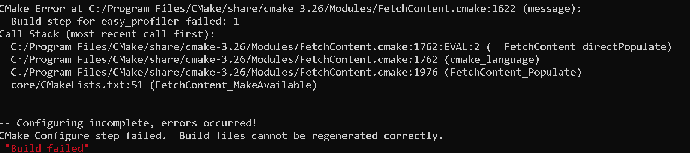

# Dependencies

## Download

## Install

### Issues
* FetchContent_MakeAvailable fails
  
  
  Check if your Project Path is to long.  
  Try to compile this library in a shorter path. 
  If it does, you shuld change the path length of your project or change a registry setting in to allow for long paths: 
  1) Press WIN+R and type 'regedit'. Press Enter and accept Admin rights.  
  2) Navigate to: 'https://www.howtogeek.com/266621/how-to-make-windows-10-accept-file-paths-over-260-characters/'
  3) On the right, find a value named LongPathsEnabled and double-click it.  
     If you don’t see the value listed, you’ll need to create it by right-clicking the FileSystem key,  
     choosing New > DWORD (32-bit) Value, and then naming the new value LongPathsEnabled.  
     Set the value from 0 to 1.
## Learn
