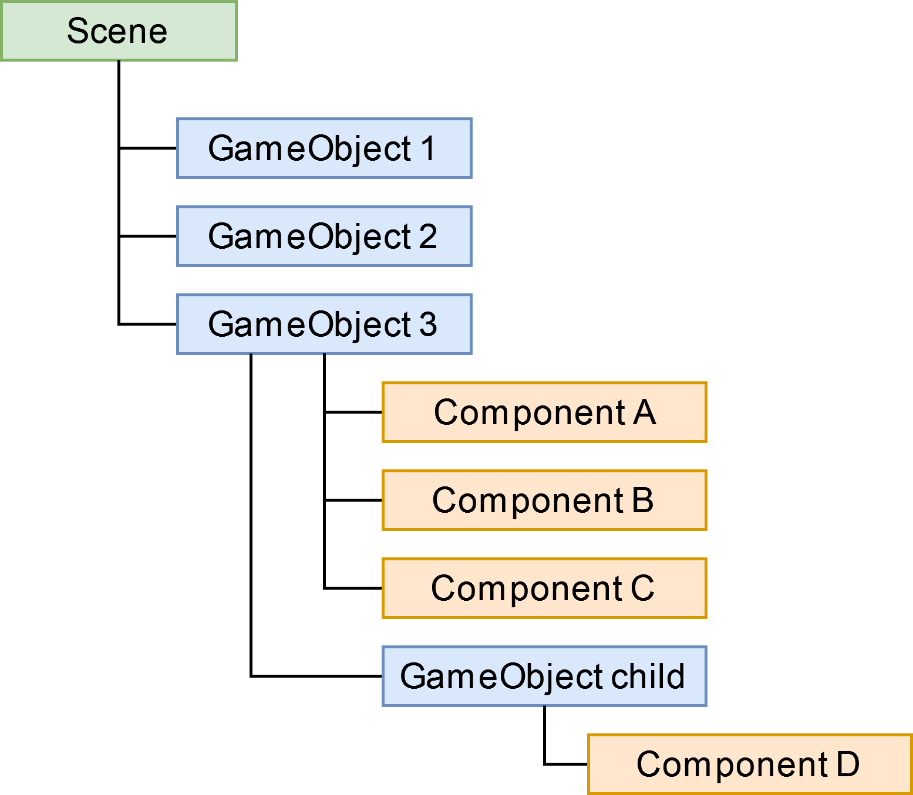
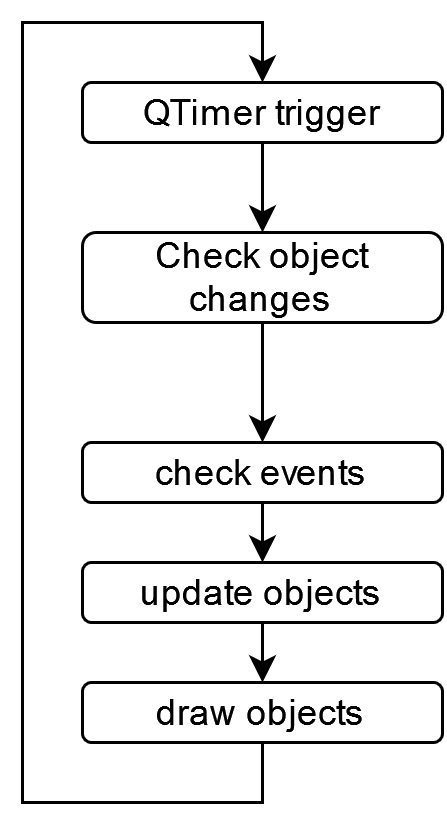

# Scene

- [Scene](#scene)
  - [Hirarchy](#hirarchy)
  - [Update loop](#update-loop)

## Hirarchy

A Scene is the engine of the library. It handles all the objects and updating stuff.  
The picture shows the Hirarchy of Objects inside a Scene.   
The topmost GameObjects in the tree hirarchy are called the root objects.  

    

## Update loop

    The Scene is updaded using a QTimer, the update loop is shown in the picture above.

    

| A Scene is the engine of the library. It handles all the objects and updating stuff. The picture shows the Hirarchy of Objects inside a Scene. The topmost GameObjects in the tree hirarchy are called the root objects. |   |
|:-------------------------|-----------------------------------------|