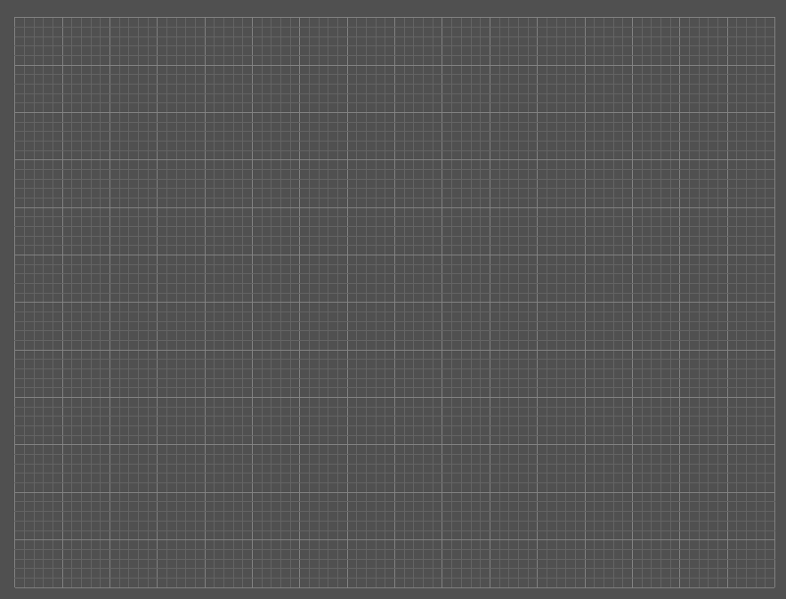

<!-- omit in toc -->
# Scene

- [Example](#example)
- [Settings](#settings)
- [How to set up a Scene](#how-to-set-up-a-scene)
  - [Populate the Scene](#populate-the-scene)

A Scene is the engine of the library. It handles all the objects and updating stuff.


---
|||
|:-------------------------|:-----------------------------------------:|
| **Scene hirarchy**<br> The picture shows the Hirarchy of Objects inside a Scene. The topmost GameObjects in the tree hirarchy are called the root objects. |  |
| **Update loop**<br> The Scene is updaded using a QTimer, the update loop is shown in the picture. |  |


## Example

``` C++
#include <QApplication>
#include "QSFML_EditorWidget.h"

int main(int argc, char* argv[])
{
    QApplication app(argc, argv);

    QSFML::SceneSettings settings;
    QSFML::Scene scene(nullptr, settings);

    scene.addObject(new QSFML::Objects::DefaultEditor());

    scene.start();
    return app.exec();
}
```
<div align="center">
     
</div>


## Settings


``` C++
#include <QApplication>
#include "QSFML_EditorWidget.h"

int main(int argc, char* argv[])
{
    QApplication app(argc, argv);

    QSFML::SceneSettings settings;

    // Background color of parts on which nothing was painted
    settings.colors.defaultBackground = sf::Color(80, 80, 80);

    // sf::ContextSettings for the render window
    settings.contextSettings.antialiasingLevel = 8;

    // QLayout margin for when the Scene has a QWidget parent
    settings.layout.margin.left = 6;
    settings.layout.margin.top = 6;
    settings.layout.margin.right = 6;
    settings.layout.margin.bottom = 6;

    settings.layout.autoAjustSize = true; // If set to true, the Scene will automatically resizes based on its parent widget.
    settings.layout.fixedSize = sf::Vector2u(1000, 700); // If autoAjustSize is false, this size will be applyed to the Scene widget

    settings.timing.frameTime = 0.01;           // Target time between frames in seconds
    settings.timing.physicsDeltaTScale = 0.1;   // Scale factor for delta time, returned from GameObject::getDeltaT() 
    settings.timing.physicsFixedDeltaT = 0.01;  // Delta time for the fixed physics calculation. GameObject::getFixedDeltaT()

    // Enable or disable the different loops
    settings.updateControlls.enableEventLoop = true;
    settings.updateControlls.enablePaintLoop = true;
    settings.updateControlls.enableUpdateLoop = true;

    // Enable or disable multithreading for the update loop
    settings.updateControlls.enableMultithreading = false;
    QSFML::Scene scene(nullptr, settings);
    
    scene.addObject(new QSFML::Objects::DefaultEditor());

    scene.start();
    return app.exec();
}
```


## How to set up a Scene
Its recommended to use a Scene inside a QMainWindow
The example below shows how the scene is set up inside a QMainWindow. 
<table>
<tr>
<td> ExampleScene.cpp </td> <td> ExampleScene.h </td>
</tr>
<tr>
<td>

```c++
#include "ExampleScene.h"
#include "ui_exampleScene.h"
#include <iostream>
#include <QCloseEvent>
#include <QDebug>

using namespace QSFML;
using namespace QSFML::Objects;

ExampleScene::ExampleScene(QWidget *parent)
    : QMainWindow(parent)
    , ui(new Ui::ExampleScene)
{
    ui->setupUi(this);
    setupScene();
}

ExampleScene::~ExampleScene()
{
    delete ui;
    delete m_scene;
}

void ExampleScene::setupScene()
{
    SceneSettings settings;
    settings.contextSettings.antialiasingLevel = 8;
    settings.timing.frameTime = 0.02;
    m_scene = new Scene(ui->SceneWidget, settings);

    DefaultEditor* defaultEditor = new DefaultEditor();
    m_scene->addObject(defaultEditor);
    m_scene->start();
}
void ExampleScene::closeEvent(QCloseEvent* event)
{
    if (m_scene)
        m_scene->stop();
    event->accept();
}


```

</td>
<td>
    
```c++
#pragma once

#include <QMainWindow>
#include "QSFML_EditorWidget.h"

QT_BEGIN_NAMESPACE
namespace Ui { class ExampleScene; }
QT_END_NAMESPACE

class ExampleScene : public QMainWindow
{
    Q_OBJECT

public:
    ExampleScene(QWidget* parent = nullptr);
    ~ExampleScene();

private:
    void setupScene();
    void closeEvent(QCloseEvent* event) override;

    Ui::ExampleScene* ui;
    QSFML::Scene* m_scene = nullptr;
};


```
</td>
</tr>
</table>


``` C++
void ExampleScene::setupScene()
{
    SceneSettings settings;
    settings.contextSettings.antialiasingLevel = 8;
    settings.timing.frameTime = 0.02;
    m_scene = new Scene(ui->SceneWidget, settings);

    DefaultEditor* defaultEditor = new DefaultEditor();
    m_scene->addObject(defaultEditor);
    m_scene->start();
}
```
Use any QWidget inside the window as a parent for the scene. In this case `ui->SceneWidget` is used as the parent widget.
The Scene will automaticly create a layout inside that parent widget and inserts its main camera to that widget.

### Populate the Scene
``` C++
void ExampleScene::setupScene()
{
    SceneSettings settings;
    m_scene = new Scene(ui->SceneWidget, settings);

    // Creates the background grid and enables the camera movement
    DefaultEditor* defaultEditor = new DefaultEditor();
    
    // Creating custom GameObjects
    Car* car = new Car();

    // Add the GameObjects to the scene
    m_scene->addObject(defaultEditor);
    m_scene->addObject(car);

    m_scene->start();
}
```
Create the GameObjects on the heap, the lifetime of the objects is handled by the Scene, as long as they belong to a Scene.
Add all objects to the Scene using: `m_scene->addObject(obj);`

